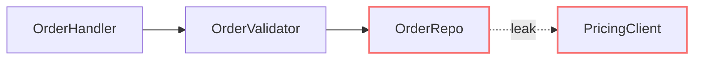

# HTML report format

Write the architectural review as a single self-contained HTML file in the OS temp directory so nothing lands in the repo. Resolve the temp dir from `$TMPDIR`, falling back to `/tmp` (or `%TEMP%` on Windows), and write to `<tmpdir>/architecture-review-<timestamp>.html` so each run gets a fresh file. Keep CSS and assets inline. Mermaid can author graph-shaped diagrams; embed its rendered SVG. Use hand-built divs and inline SVG for mass diagrams and cross-sections. Choose the form that explains the candidate.

## Scaffold

```html
<!doctype html>
<html lang="en">
  <head>
    <meta charset="utf-8" />
    <meta name="viewport" content="width=device-width, initial-scale=1" />
    <title>Architecture review for {{repo name}}</title>
    <style>
      body { margin: 0; background: #000; color: #fff; font: 16px/1.5 system-ui, sans-serif; }
      main { max-width: 1100px; margin: auto; padding: 24px; }
      article { padding: 24px 0; border-top: 1px solid #444; }
      a { color: inherit; }
      .comparison { display: grid; grid-template-columns: repeat(2, minmax(0, 1fr)); gap: 24px; }
      .files { font-family: monospace; overflow-wrap: anywhere; }
      svg { display: block; max-width: 100%; height: auto; }
      .seam { stroke-dasharray: 4 4; }
      .leak { stroke: #f87171; }
      @media (max-width: 700px) { .comparison { grid-template-columns: 1fr; } }
    </style>
  </head>
  <body>
    <main>
      <header>...</header>
      <section id="candidates">...</section>
      <section id="top-recommendation">...</section>
    </main>
  </body>
</html>
```

## Header

Repo name, date, and a compact legend: solid box = module, dashed line = seam, red arrow = leakage, thick outline = deep module. No introduction paragraph. Straight into the candidates.

## Candidate section

The diagrams carry the weight. Prose is sparse, plain, and uses the glossary terms (from [Deep Modules](../principles/deep-modules.md)) without ceremony.

Each candidate is one `<article>`:

- **Title**: short, names the deepening (e.g. "Collapse the Order intake pipeline").
- **Assessment**: recommendation strength (`Strong`, `Worth exploring`, `Speculative`) and dependency category (`in-process`, `local-substitutable`, `ports & adapters`, `mock`) as plain text. Read [DEEPENING.md](DEEPENING.md) to classify the dependencies.
- **Files**: monospaced list.
- **Before / After diagram**: the centrepiece. Two columns, side by side. See patterns below.
- **Problem**: one sentence. What hurts.
- **Solution**: one sentence. What changes.
- **Wins**: benefits in locality, leverage, and testability. Use bullets, ≤6 words each. e.g. "Tests hit one interface", "Pricing logic stops leaking", "Delete 4 shallow wrappers".
- **ADR callout** (if applicable): one line stating the conflict and why it is worth reopening.

No paragraphs of explanation. If the diagram needs a paragraph to be understood, redraw the diagram.

## Diagram patterns

Pick the pattern that fits the candidate. Mix them. Don't make every diagram look the same. Variety is part of the point.

### Mermaid graph (the workhorse for dependencies / call flow)

Use a Mermaid `flowchart` or `graph` when the point is "X calls Y calls Z, and look at the mess." Render it to SVG with a transparent background and white labels. Use red for leakage edges and line weight to distinguish the deep module. Sequence diagrams work well for "before: 6 round-trips; after: 1."

Author the diagram in Mermaid, then embed the rendered SVG:



### Hand-built boxes-and-arrows (when Mermaid's layout fights you)

Modules as `<div>`s with borders and labels. Arrows as inline SVG `<line>` or `<path>` elements positioned absolutely over a relative container. Reach for this when you want the "after" diagram to feel like one thick-bordered deep module with greyed-out internals, since Mermaid won't render that with the right weight.

### Cross-section (good for layered shallowness)

Stack horizontal bands with a heavier left border to show layers a call passes through. Before: 6 thin layers each doing nothing. After: 1 thick band labelled with the consolidated responsibility.

### Mass diagram (good for "interface as wide as implementation")

Two rectangles per module: one for interface surface area, one for implementation. Before: interface rectangle is nearly as tall as the implementation rectangle (shallow). After: interface rectangle is short, implementation rectangle is tall (deep).

### Call-graph collapse

Before: a tree of function calls rendered as nested boxes. After: the same tree collapsed into one box, with the now-internal calls shown faded inside it.

## Style guidance

- Use a true black (#000) background, white primary text, compact spacing, and minimal copy. Separate candidates with headings and rules rather than decorative cards or pills.
- Colour sparingly: one accent (emerald or indigo) plus red for leakage and amber for warnings.
- Keep diagrams ~320px tall so before/after sits comfortably side by side without scrolling.
- Use compact, readable module labels inside diagrams.
- Keep the report static. Use inline CSS and SVG, with no continuously repainting animations.

## Top recommendation section

Candidate name, one sentence on why, and an anchor link to its section.

## Tone

**Use the project's domain glossary for domain vocabulary, and Deep Modules for architecture vocabulary.** If `CONTEXT.md` defines "Order," talk about "the Order intake module," not "the FooBarHandler," and not "the Order service."

Plain English, concise, but the architectural nouns and verbs come straight from [Deep Modules](../principles/deep-modules.md). Concision is not an excuse to drift.

**Use exactly:** module, interface, implementation, depth, deep, shallow, seam, adapter, leverage, locality.

**Never substitute:** component, service, unit (for module) · API, signature (for interface) · layer, wrapper (for module, when you mean module).

**Phrasings that fit the style:**

- "Order intake module is shallow: interface nearly matches the implementation."
- "Pricing leaks across the seam."
- "Deepen: one interface, one place to test."
- "Two adapters justify the seam: HTTP in prod, in-memory in tests."

**Wins bullets** name the gain in glossary terms: *"locality: bugs concentrate in one module"*, *"leverage: one interface, N call sites"*, *"interface shrinks; implementation absorbs the wrappers"*. Don't write *"easier to maintain"* or *"cleaner code"*, because those terms aren't in the glossary and don't earn their place.

No hedging, no throat-clearing, no "it's worth noting that…". If a term isn't in the Deep Modules glossary, reach for one that is before inventing a new one.
